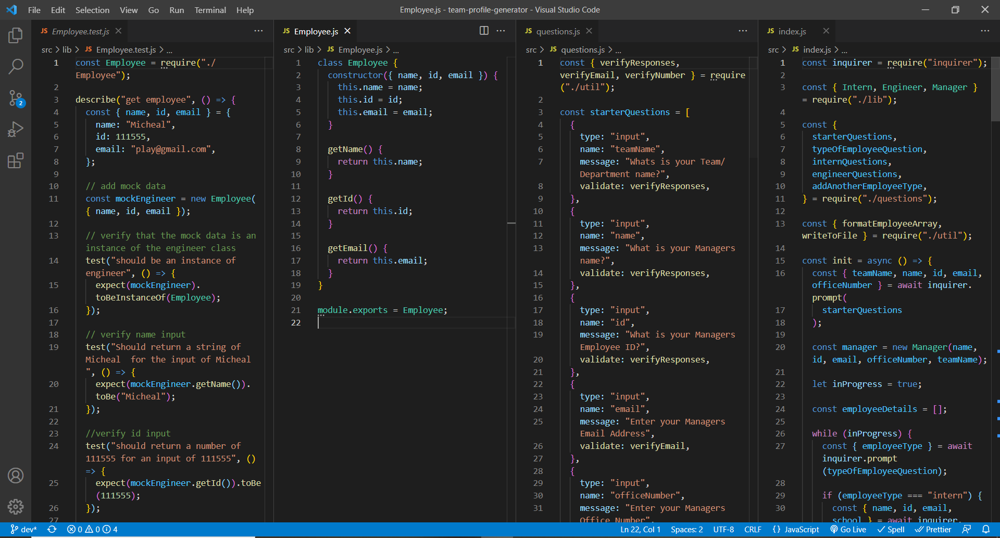

# Team-Profile-Generator

## Description:

This is a Noje.Js command line application that allows the user to dynamically create a HTML team profile Web-page that acquires information about employees on a software engineering team. The application will then generates an HTML webpage that displays summaries for each person.

## Acceptance Criteria:

```md
GIVEN a command-line application that accepts user input
WHEN I am prompted for my team members and their information
THEN an HTML file is generated that displays a nicely formatted team roster based on user input
WHEN I click on an email address in the HTML
THEN my default email program opens and populates the TO field of the email with the address
WHEN I click on the GitHub username
THEN that GitHub profile opens in a new tab
WHEN I start the application
THEN I am prompted to enter the team manager’s name, employee ID, email address, and office number
WHEN I enter the team manager’s name, employee ID, email address, and office number
THEN I am presented with a menu with the option to add an engineer or an intern or to finish building my team
WHEN I select the engineer option
THEN I am prompted to enter the engineer’s name, ID, email, and GitHub username, and I am taken back to the menu
WHEN I select the intern option
THEN I am prompted to enter the intern’s name, ID, email, and school, and I am taken back to the menu
WHEN I decide to finish building my team
THEN I exit the application, and the HTML is generated
```

## User Story

```md
AS A manager
I WANT to generate a webpage that displays my team's basic info
SO THAT I have quick access to their emails and GitHub profiles
```

## Video :

To see how the application works <a href='https://drive.google.com/file/d/1wB6xwaIL2Ra1J6YIZxavdqfMgsExmtCN/view?usp=sharing'>click here </a>

## Preview: Image of the Code:



## Installation

Run the following script to install the packages required for the application:

```
npm install inquirer

npm install @types/jest -D

npm install jest -D

```

## Scripts

Ensure that the package.json file has the following script:

```
 "start": "node src/index.js"

 "test": "jest --verbose --watch"

 "test:watch": "jest --verbose --watch"

```

## Usage

To use the application run the following script:

```
npm run start

npm run test

npm run test:watch
```

## Tools Used

- node.js
- inquirer - npm
- Languages:
- JavaScript
- JQuery
